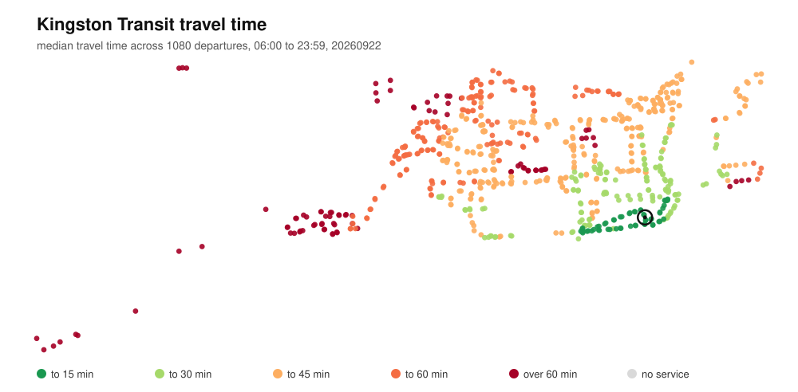
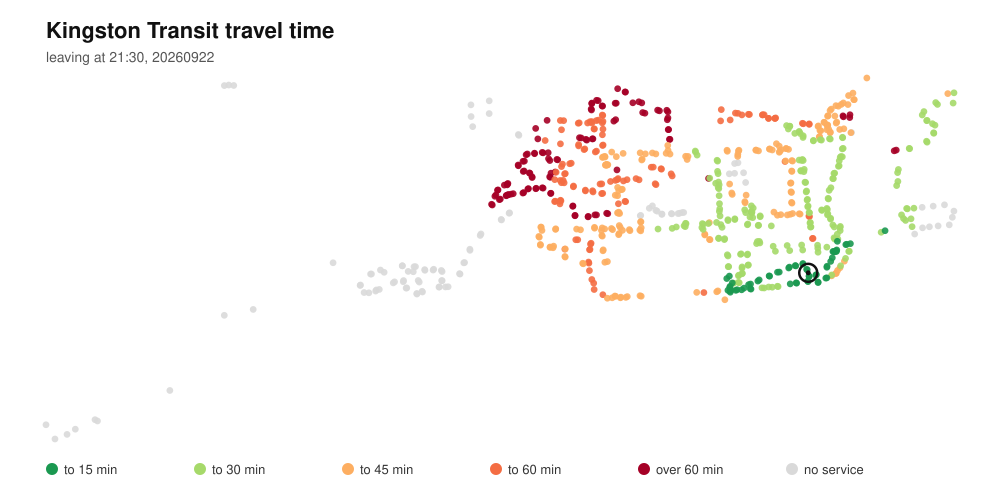

# Limestone

A public transit routing engine in C++17 for Kingston Transit, built on the RAPTOR algorithm. It plans trips over the city's real GTFS schedule in under a millisecond, and runs full-day accessibility sweeps across a thread pool to measure how reachable Kingston actually is from a given point.



## The finding

Median travel time from the centre of Queen's campus to all 784 Kingston Transit stops, across 1,080 departure minutes between 06:00 and 23:59 on a weekday.

Leaving at 08:30, every stop in the city is reachable and 73% are within 45 minutes. By 21:30 that falls to 58%, and 104 stops cannot be reached at all. By 23:30, 609 of 784 stops are unreachable.



The stops that drop out in the evening are not scattered. They cluster in the western neighbourhoods and the northern edge of the city, so whole areas lose service rather than individual stops.

| Leaving campus | ≤30 min | ≤45 min | ≤60 min | Unreachable |
|---|---|---|---|---|
| 08:30 | 36% | 73% | 93% | 0 |
| 21:30 | 34% | 58% | 73% | 104 |
| 23:30 | 3% | 9% | 19% | 609 |

## How it works

The engine implements RAPTOR (Round-Based Public Transit Routing, Delling, Pajor and Werneck, Microsoft Research 2012). Each round computes the earliest arrival at every stop using at most *k* vehicles: round 1 is everywhere reachable on one bus, round 2 adds one transfer, and so on. Between rounds it relaxes walking transfers between nearby stops.

```
GTFS files → feed structures → day timetable → RAPTOR rounds → journey
```

- **Loader** parses the five GTFS files into flat vectors, interning string ids to dense integers so the routing code works in integers throughout.
- **Timetable** groups trips into patterns that share an identical stop sequence, and lays out their stop times trip-major so a scan reads consecutive memory.
- **RAPTOR** scans only the patterns touching stops improved in the previous round, and binary-searches each pattern's sorted departures for the earliest catchable trip.
- **Journeys** are recovered by following each label's parent pointers back from the destination through the rounds.

## Usage

```
limestone info   FEED_DIR
limestone stops  FEED_DIR QUERY
limestone route  FEED_DIR FROM TO YYYYMMDD HH:MM
limestone reach  FEED_DIR LAT,LON YYYYMMDD HH:MM
limestone sweep  FEED_DIR LAT,LON YYYYMMDD OUT.csv [THREADS]
limestone map    FEED_DIR LAT,LON YYYYMMDD OUT.svg [HH:MM] [THREADS]
```

Planning a trip, by stop name or stop id:

```
$ limestone route data/kingston "Cataraqui Centre" "King / Lower University" 20260922 08:30
from:      S02077  Cataraqui Centre
to:        00424  King / Lower University
departing: 20260922 at 08:30
patterns:  88 (built in 6 ms)
query:     196 microseconds

  1 bus, arrive 09:13
    08:30  walk 1 min to Cataraqui Centre (S02078)
    08:40  board route 502 (Express – Downtown via Bayridge/Front) at Cataraqui Centre (S02078)
    09:11  get off at Queen's / Kingston General Hospital (S00426)
    09:11  walk 3 min to King / Lower University (00424)
```

A journey with more transfers is reported only when it arrives strictly earlier. At 21:30 the same trip offers one bus arriving 22:24 after a 25 minute wait, or two buses arriving 22:02.

## Walking transfers changed the answers

Before footpaths existed, that same query returned three buses arriving at 09:52. The express bus leaves from a different bay at Cataraqui Centre and never stops at the requested destination, only at a stop three minutes' walk away, so no single pair of stop ids could find it. Kingston has four separate stops named Cataraqui Centre and two named King / Lower University, one per direction.

The engine precomputes a footpath between every pair of stops within 300m and relaxes those paths after each round.

## Performance

A full-day sweep runs 1,080 one-to-all queries over the city, one per departure minute. Measured on an 8-core Apple Silicon machine (4 performance cores, 4 efficiency cores), best of three runs, compiled with `-O3`:

| Threads | Elapsed | Per query | Speedup |
|---|---|---|---|
| 1 | 48 ms | 44 µs | 1.00x |
| 2 | 29 ms | 27 µs | 1.66x |
| 4 | 16 ms | 15 µs | 3.00x |
| 8 | 14 ms | 13 µs | 3.43x |

Scaling is close to linear to four threads, then flattens: the additional threads run on efficiency cores, which are substantially slower than the performance cores. Output is byte-identical at every thread count, which the test suite checks.

The thread pool is a shared work queue guarded by a mutex. Workers claim chunks of departure minutes rather than single minutes, so the lock is taken a few dozen times across the sweep rather than once per query. Each worker accumulates into its own buffer, and the buffers are merged after the threads join.

## Building

Requires CMake 3.24+ and a C++17 compiler.

```
git clone https://github.com/Rayyan-Rizvi/Limestone-Transit.git
cd Limestone-Transit
./scripts/fetch_gtfs.sh
cmake -S . -B build -DCMAKE_BUILD_TYPE=Release
cmake --build build
ctest --test-dir build
```

The feed is downloaded rather than committed, because the City of Kingston republishes it as schedules change. The current feed covers 12 September to 20 December 2026; queries outside that range return no service.

## Design decisions

**Transfer buffer of 60 seconds.** Connections with zero slack are fiction when buses run late. The value is a judgement call, and it changes results: the two-bus evening option above depends on a three-minute connection downtown and disappears under a five-minute buffer.

**300 m walking limit.** Enough to connect bus bays at the same mall and opposite sides of a street without inventing implausible transfers. Walks do not chain, so a rider can walk from a stop to a nearby one but not onward to a third.

**500 m origin radius.** No bus runs through the middle of Queen's campus; routes skirt its edges on Union, King and Division. Starting from a single stop would bias results toward one side, so `reach`, `sweep` and `map` start from every stop within 500 m of the given point, each offset by its walking time.

**Median rather than best case.** The maps report the median across every departure minute, which answers "how long if I show up at a random time" rather than "how fast if I time it perfectly." Cataraqui Centre has a 25 minute best case and a 36 minute median.

**Flat vectors over object graphs.** The feed is stored as a few large vectors with integer indices rather than objects linked by pointers. RAPTOR scans stop times in bulk doing little work per element, so memory locality dominates.

## Limitations

- Stop name lookup resolves to one stop and relies on walking transfers to reach other stops with the same name. That works in Kingston because same-name stops are close together; a city where one name spans a kilometre would need true multi-origin search.
- No real-time data. The engine uses scheduled times only, so it cannot account for delays or cancellations.
- Straight-line walking distance with a 1.3 detour factor, not street routing. Trips are assumed not to overtake each other within a pattern, which allows the binary search for the earliest catchable trip.

## Testing

58 tests covering CSV parsing with quoted fields and byte order marks, GTFS times past midnight, the loader against a hand-built feed with deliberately broken rows, pattern construction, RAPTOR arrival times and transfer limits, footpath relaxation, journey reconstruction, and sweep results across thread counts.

```
ctest --test-dir build --output-on-failure
```

## References

https://www.microsoft.com/en-us/research/wp-content/uploads/2012/01/raptor_alenex.pdf

https://api.cityofkingston.ca/gtfs/gtfs.zip